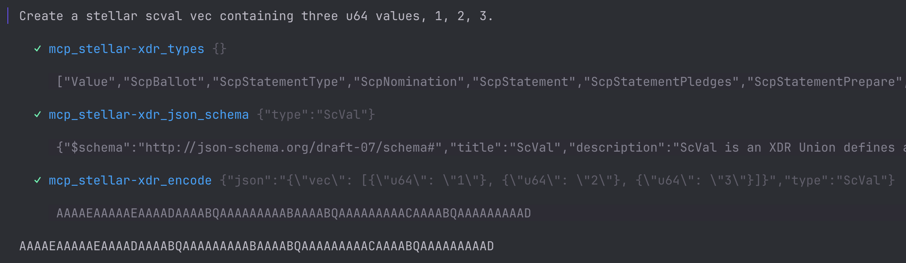
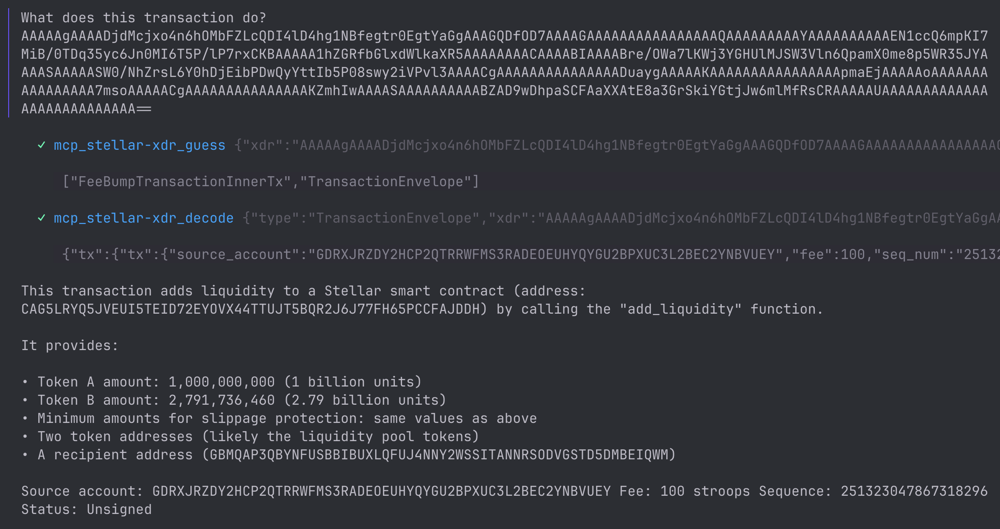
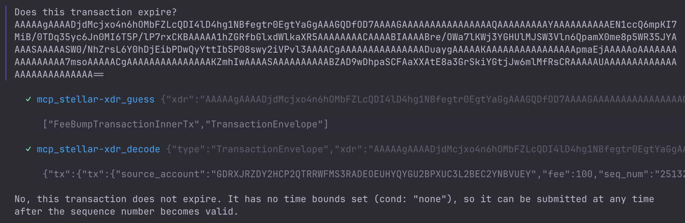
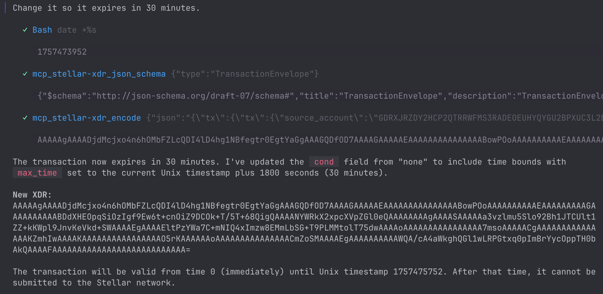
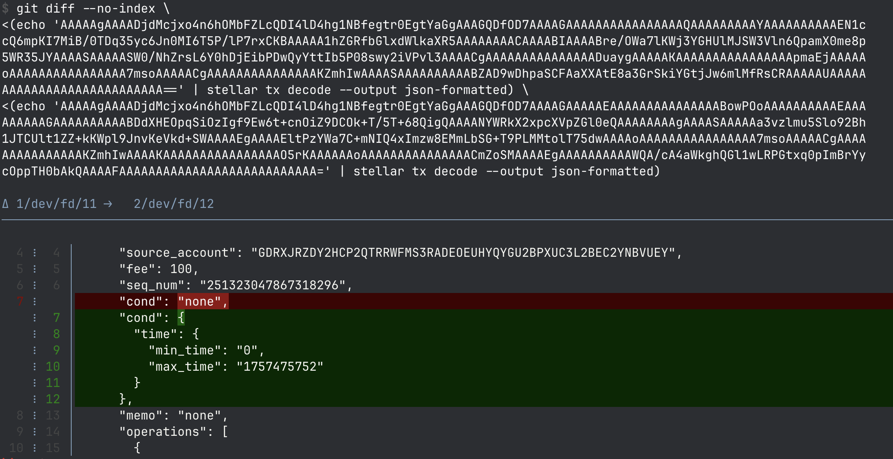

# Stellar MCP Server for XDR

An [Model Context Protocol (MCP)] server that provides tools for interfacing
with Stellar XDR via XDR-JSON and JSON Schema.

Agents can use the MCP server to understand what XDR means, modify XDR values,
and create new XDR values.

[Model Context Protocol (MCP)]: https://www.claudemcp.com/

Provides five tools:

- `mcp_stellar-xdr_types` - Get the supported XDR types.
- `mcp_stellar-xdr_json_schema` - Get the JSON schema for an XDR type.
- `mcp_stellar-xdr_guess` - Guess what type Stellar XDR is, getting back a list
  of possible types.
- `mcp_stellar-xdr_decode` - Decode a Stellar XDR to JSON.
- `mcp_stellar-xdr_encode` - Encode a Stellar XDR from JSON.

## Usage

To use with agents, setup a `stdio` MCP configuration with your agent calling
the following command:

```
{
  "command": "npx",
  "args": ["deno", "run", "--allow-read", "https://github.com/stellar/mcp-stellar-xdr/raw/refs/heads/main/mcp-stellar-xdr.ts"]
}
```

If you have `deno` installed you can omit the `npx` command and call `deno`
directly.

## Examples

### Create an XDR value



### Describe a transaction



### Answer a specific question about a transaction



### Modify a transaction




